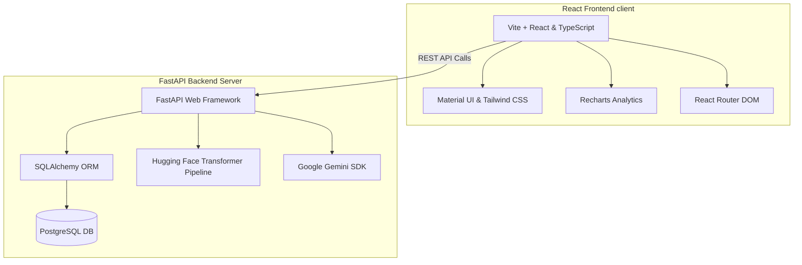

# MindCare - AI-Powered Mental Health Companion

MindCare is a comprehensive, state-of-the-art mental health companion proposed as our final year project designed to provide emotional support, track user wellbeing, and guide users to professional clinical help when necessary. The platform combines conversational AI with local machine learning models, structured self-assessments, persistent daily journaling, and interactive wellness resources to create a private, supportive, and data-driven emotional support system.

---

## Key Features

### 1. Dynamic AI Companion (Assistant)
- **Empathetic Conversations:** Underpinned by the **Google Gemini API (`gemini-2.5-flash`)**, acting as an active-listening, supportive virtual assistant.
- **Context-Aware Personalization:** Automatically adapts its conversational tone based on the user's latest self-assessment scores and journal sentiment analysis, without ever mentioning the data collection directly.
- **Multilingual Script Support:** Natively converses in:
  - **English**
  - **Roman Urdu** (Urdu words in English letters)
  - **Urdu script**
  It dynamically matches the user's script choice and enforces strict script alignment rules.
- **Strict Boundary Framework:** Safe-guarded with strict boundaries. It prevents self-diagnosis, avoids therapy replacement claims, and intelligently recommends nearby clinics only during high-severity scores or crisis states.

### 2. Structured Self-Assessment
- **Mental Wellbeing Testing:** Uses standard assessment scales to evaluate user levels of **Anxiety**, **Depression**, and **Stress**.
- **Historical Tracking:** Saves all questionnaire attempts in a persistent database, letting users visualize their emotional progress over time on an analytical dashboard.

### 3. Daily Journaling & Weekly Analytics
- **Persistent Daily Logs:** Allows users to document their daily thoughts. Subsequent inputs on the same day append to the existing log to maintain daily coherence.
- **Local Hugging Face NLP Classifier:** Integrates a locally hosted transformer classification pipeline that parses journal entries into four states: `Normal`, `Anxiety`, `Stress`, and `Depression`.
- **Polarity Snapshots:** Computes numerical polarity scores dynamically.
- **Weekly Analytical Reports:** Tracks weekly sentiment trends (`improving`, `stable`, `worsening`) and maps out dominant emotional state distributions.

### 4. Interactive Meditation & Guided Wellness
- **Breathing Exercises:** Interactive, visual guidance pages for:
  - *Deep Breathing*
  - *Breath Focus*
  - *Square Breathing* (calming box method)
- **Guided Meditations:** Mindful tracks including *Body Scan*, *Mindful Awareness*, *Loving Kindness*, *Progressive Relaxation*, and *Calm Place Visualization*.
- **Grounding Techniques:** Interactive guides for the *5-4-3-2-1 Technique* and *Progressive Muscle Relaxation*.
- **Relaxing Audios:** High-fidelity nature ambient audios (Ocean Waves, Rain Forest, Mountain Stream, Forest Birds, Rain & Thunder, Sea Waves) built with a custom audio control system.

### 5. Clinic Locator
- **Geolocated Search:** Helps users locate verified clinics nearby based on coordinates.
- **Distance Calculation:** Employs the **Haversine formula** to calculate precise distances between the user's coordinates and registered clinic locations.

### 6. Profile Customization & Security
- **Secure Authentication:** Implements JWT-based access and refresh tokens along with refresh-token rotation to reduce the risk of token theft and strengthen overall session security.
- **Security Updates:** Supports secure password change operations and code-verified password reset via SMTP email routing.
- **Personalized UI:** Custom dark/light mode provider and email preference toggling.

---

## Technology Stack



### Frontend
- **Framework:** Vite + React (TypeScript)
- **Styles:** Tailwind CSS + Material UI (MUI) for a premium, responsive experience
- **Charts:** Recharts for historical score graphs
- **Routing:** React Router v7
- **Icons:** Lucide React

### Backend
- **Core Framework:** FastAPI (Python 3.10+)
- **Database ORM:** SQLAlchemy with PostgreSQL (Neon DB compatible)
- **Database Migrations:** Alembic
- **Email Server:** FastAPI-Mail (SMTP wrapper)
- **Authentication:** JWT-based auth using PyJWT for issuing and validating access/refresh tokens, with password hashing handled by the project’s password-hasher implementation and token signing configured through environment settings

### Machine Learning / AI
- **Generative AI:** Google Gemini Developer API (`google-genai` SDK)
- **Local Classification:** Hugging Face `transformers` pipeline loaded with a local text classification model (`safetensors` format)

---

## Key Directory Structure

```text
MindCare/
├── backend/
│   ├── alembic/              # Database migration history
│   ├── app/
│   │   ├── dependency/       # Auth dependency middleware
│   │   ├── models/           # SQLAlchemy Database Models
│   │   ├── routes/           # FastAPI API Endpoints
│   │   ├── schemas/          # Pydantic Schemas (validation)
│   │   ├── services/         # Business logic (Gemini, Inference, Assessment, etc.)
│   │   ├── db.py             # DB connection initializer
│   │   ├── main.py           # FastAPI main app entry point
│   │   └── settings.py       # Pydantic Settings & ENV parser
│   ├── tests/                # load testing and Unit testing files
│   ├── scheduler.py          # Cron/Manual script for weekly report generation
│   ├── requirements.txt      # Python dependencies
│   └── pytest.ini            # Test configurations
└── frontend/
    ├── public/               # Static assets (audios)
    ├── src/
    │   ├── api/              # AxiosInstance for API calls
    │   ├── app/
    │   │   ├── components/   # Pages & shared UI components
    │   │   ├── pages/        # Dashboard, Assessment, and Wellness page components
    │   │   ├── context/      # AuthContext & state providers
    │   │   ├── hooks/        # Custom hook for document title
    │   │   ├── App.tsx       # Root Component
    │   │   └── AppRoutes.tsx # Client Route configurations
    │   ├── styles/           # Global styles and custom CSS variables
    │   └── main.tsx          # Frontend entry point
    ├── package.json          # Node dependencies & scripts
    └── vite.config.ts        # Vite build configurations
```

---

## Getting Started

### Prerequisites
- **Python 3.10+**
- **Node.js (v18+)**
- **PostgreSQL** database instance (local or hosted, e.g., Neon DB)

---

### Backend Setup

1. **Navigate to the backend directory:**
   ```bash
   cd backend
   ```

2. **Create and activate a virtual environment:**
   ```bash
   python -m venv venv
   # On Windows (PowerShell):
   .\venv\Scripts\Activate
   # On macOS/Linux:
   source venv/bin/activate
   ```

3. **Install python packages:**
   ```bash
   pip install -r requirements.txt
   ```

4. **Create a `.env` file** in the root of the `backend/` directory following this format:
   ```env
   DATABASE_URL="postgresql://<username>:<password>@localhost:5432/MindCare"
   ACCESS_TOKEN_SECRET_KEY="your-jwt-access-secret"
   REFRESH_TOKEN_SECRET_KEY="your-jwt-refresh-secret"
   ALGORITHM="HS256"
   ACCESS_TOKEN_EXPIRE_TIME=20
   REFRESH_TOKEN_EXPIRE_TIME=10

   MAIL_USERNAME="your-email@gmail.com"
   MAIL_PASSWORD="your-email-app-password"
   MAIL_FROM="your-email@gmail.com"
   MAIL_SERVER="smtp.gmail.com"
   MAIL_PORT=587
   MAIL_STARTTLS=True
   MAIL_SSL_TLS=False

   CORS_ORIGIN="http://localhost:5173"
   GEMINI_API_KEY="your-google-gemini-api-key"
   GEMINI_MODEL="gemini-2.5-flash"
   ```

5. **Run database migrations:**
   ```bash
   alembic upgrade head
   ```

6. **Start the FastAPI server:**
   ```bash
   uvicorn app.main:app --reload
   ```
   *The backend will launch at `http://localhost:8000` with Swagger docs available at `http://localhost:8000/docs`.*

---

### Frontend Setup

1. **Navigate to the frontend directory:**
   ```bash
   cd ../frontend
   ```

2. **Install Node dependencies:**
   ```bash
   npm install
   ```

3. **Launch the Vite development server:**
   ```bash
   npm run dev
   ```
   *The frontend will run at `http://localhost:5173`.*

---

## Weekly Analytics Scheduler

To process user daily journals and compile weekly mental health reports, a background scheduler is provided. This analyzes diary logs created during the current calendar week (since Monday 00:00:00).

- **Process all active users for the current week:**
  ```bash
  python scheduler.py
  ```
- **Process a specific user by ID manually:**
  ```bash
  python scheduler.py --user_id <USER_ID>
  ```
  *(e.g., `python scheduler.py --user_id 1`)*

---

## Security & Privacy Notice
MindCare respects user privacy. Journal entries and self-assessment history are stored in a private database. AI assistant context analysis is computed during runtime session requests and is not permanently trained on by external large language models.